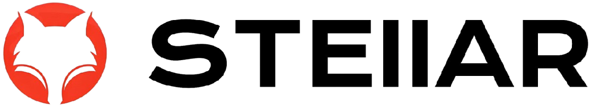

<!-- links -->

[your-project-path]: goer3/stellar
[go-shield]: https://img.shields.io/badge/Go-1.23-c14438?style=social&logo=Go
[go-url]: https://go.dev/dl/
[react-shield]: https://img.shields.io/badge/React-18+-blue.svg?style=social&logo=React&logoColor=087ea4
[react-url]: https://react.dev/
[contributors-shield]: https://img.shields.io/github/contributors/goer3/stellar.svg?style=social&logo=github
[contributors-url]: https://github.com/goer3/stellar/graphs/contributors
[forks-shield]: https://img.shields.io/github/forks/goer3/stellar.svg?style=social&logo=github
[forks-url]: https://github.com/goer3/stellar/network/members
[stars-shield]: https://img.shields.io/github/stars/goer3/stellar.svg?style=social&logo=githubsponsors
[stars-url]: https://github.com/goer3/stellar/stargazers
[issues-shield]: https://img.shields.io/github/issues/goer3/stellar.svg?style=social&logo=github
[issues-url]: https://img.shields.io/github/issues/goer3/stellar.svg

<br/>
<div align="center">
  
  <br/><br/>
  <p align="center">
    <a href="https://github.com/goer3/stellar">查看DEMO</a>
    ·
    <a href="https://github.com/goer3/stellar/issues">报告BUG</a>
    ·
    <a href="https://github.com/goer3/stellar/issues">提出新特性</a>
  </p>

[![Go][go-shield]][go-url]
[![React][react-shield]][react-url]
[![Stargazers][stars-shield]][stars-url]
[![Contributors][contributors-shield]][contributors-url]
[![Forks][forks-shield]][forks-url]
[![Issues][issues-shield]][issues-url]

</div>

## 目录

- [目录](#目录)
  - [项目介绍](#项目介绍)
    - [主要特性](#主要特性)
  - [上手指南](#上手指南)
    - [开发前您需要准备](#开发前您需要准备)
    - [项目初始化](#项目初始化)
  - [项目目录结构说明](#项目目录结构说明)
  - [系统架构设计](#系统架构设计)
  - [部署](#部署)
  - [使用到的第三方库](#使用到的第三方库)
    - [前端开发库](#前端开发库)
    - [后端开发库](#后端开发库)
  - [贡献者](#贡献者)
    - [如何参与开源项目](#如何参与开源项目)
  - [联系我](#联系我)
  - [版权说明](#版权说明)
  - [鸣谢](#鸣谢)

### 项目介绍

Stellar 是一个基于 Go 和 React 构建的新一代多数据源支持的智能运维监控告警平台。

#### 主要特性

- 🚀 现代化的技术栈
- 📦 容器化部署支持
- 🔐 细粒度的权限控制
- 🎯 简单易用的操作界面
- 📊 丰富的监控指标

### 上手指南

#### 开发前您需要准备

#### 项目初始化

### 项目目录结构说明

### 系统架构设计

请阅读 [ARCHITECTURE.md](https://github.com/goer3/stellar/docs/ARCHITECTURE.md) 查阅为该项目的架构。

### 部署

暂无

### 使用到的第三方库

#### 前端开发库

```bash
# Vite：创建项目
npm create vite@latest web --template react

# Prettier：代码格式化
npm install --save-dev --save-exact prettier

# Less：将 Less 样式转换为 CSS 样式的工具
npm install -D less

# Antd
npm install antd --save

# Misans
npm install misans --save

# React-router
npm i react-router react-router-dom --save

# React-helmet
npm i react-helmet --save 
```

#### 后端开发库

```bash
# Cobra：Cobra is a library for creating powerful modern CLI applications.
go get -u github.com/spf13/cobra
```

### 贡献者

请阅读 **CONTRIBUTING.md** 查阅为该项目做出贡献的开发者。

#### 如何参与开源项目

贡献使开源社区成为一个学习、激励和创造的绝佳场所。你所作的任何贡献都是**非常感谢**的。

1. Fork the Project
2. Create your Feature Branch (`git checkout -b feature/AmazingFeature`)
3. Commit your Changes (`git commit -m 'Add some AmazingFeature'`)
4. Push to the Branch (`git push origin feature/AmazingFeature`)
5. Open a Pull Request

### 联系我

  <!-- profile logo 个人资料徽标 -->
  <div>
    <a href="https://ezops.cn"></a>&emsp;
    <a href="https://ezops.cn"></a>&emsp;
    <a href="https://ezops.cn"></a>&emsp;
    <a href="https://ezops.cn"></a>&emsp;
    <a href="https://ezops.cn"></a>&emsp;  
  </div>

### 版权说明

该项目签署了 Apache 2.0 授权许可，详情请参阅 [LICENSE.txt](https://github.com/goer3/stellar/blob/main/LICENSE.txt)

### 鸣谢

- [GitHub Emoji Cheat Sheet](https://www.webpagefx.com/tools/emoji-cheat-sheet)
- [Img Shields](https://shields.io)
